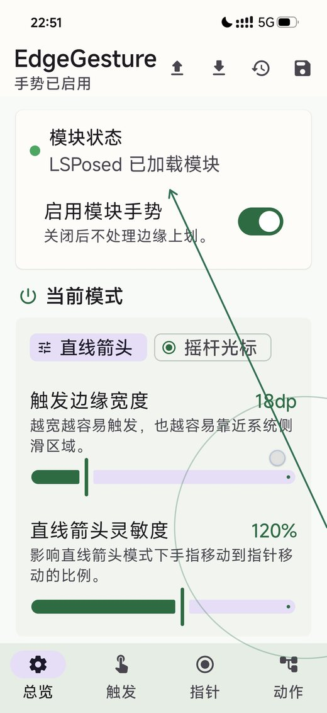
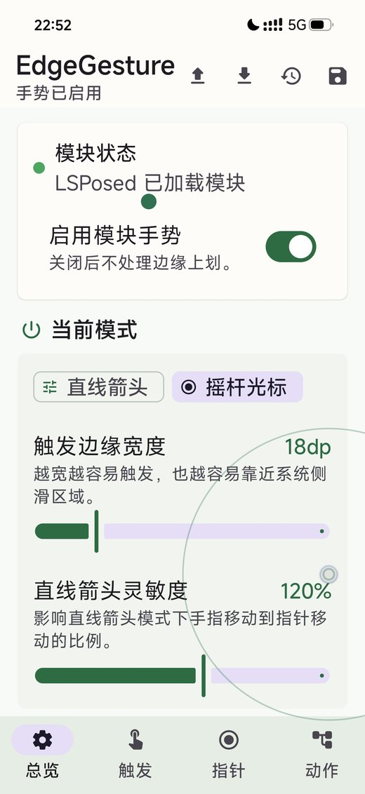

# EdgeGesture

One-handed edge gestures for LSPosed/Xposed. EdgeGesture helps you tap hard-to-reach areas of the screen with a right-edge gesture, including a line pointer mode and a Tracker + Cursor mode.


<p align="center">
  
  
</p>

[中文](#中文) | [Download APK](https://github.com/Fieldtrans/EdgeGesture/releases/latest)

## Highlights

- One-handed screen tapping from the right edge.
- Line arrow pointer mode: release to tap at the arrow tip.
- Tracker + Cursor mode inspired by joystick-style cursor control.
- Adjustable trigger area, control circle, pointer speed, smoothing, color, cancel timeout, and cancel distance.
- Top-edge notification shade trigger with a lightweight pre-animation.
- Configuration import and export.
- No transparent full-screen touch layer; gesture monitoring runs through the LSPosed/Xposed hook path.

## Requirements

- Rooted Android device.
- LSPosed installed and enabled.
- Android 16 / API 36 target build.
- LSPosed scope should include Android system/framework.

## Installation

1. Download the latest APK from [Releases](https://github.com/Fieldtrans/EdgeGesture/releases/latest).
2. Install the APK.
3. Enable EdgeGesture in LSPosed.
4. Make sure the module scope includes Android system/framework.
5. Reboot the phone.
6. Open EdgeGesture and enable the gesture mode you want.

If gestures do not respond, open LSPosed logs and search for `EdgeGesture`.

## How It Works

The app itself is only a settings panel. The gesture listener is injected into `system_server` through LSPosed/Xposed, so gestures can keep working after the app process is killed.

The current design keeps the overlay visual-only and avoids using a transparent full-screen touch layer. This reduces conflict with normal touches and system back gestures.

## Modes

### Line Pointer

Swipe up from the right edge to show a green arrow. Move your thumb inside a small control area; the arrow maps that movement to a larger screen range. Releasing taps at the arrow tip.

### Tracker + Cursor

Swipe up to show a tracker ball and cursor. Move the tracker in a joystick-like area to control the cursor. Releasing outside the cancel circle performs a tap.

## Build

```bash
./gradlew :app:assembleRelease
```

Release APK output:

```text
app/build/outputs/apk/release/app-release.apk
```

For easier local testing and upgrade compatibility with test builds, the current release build uses the debug signing configuration.

## Status

Current version: `1.0`.

This module hooks input handling inside `system_server`. Use it carefully and keep a working recovery path before testing custom builds.

## Contributors

See [CONTRIBUTORS.md](CONTRIBUTORS.md).

## 中文

EdgeGesture 是一个 LSPosed/Xposed 单手边缘手势模块，用来解决大屏手机单手点不到屏幕上方或远处区域的问题。


[下载 APK](https://github.com/Fieldtrans/EdgeGesture/releases/latest)

## 功能亮点

- 从右侧边缘上划，触发单手点击。
- 直线箭头模式：松手后点击箭头尖的位置。
- Tracker + Cursor 摇杆光标模式。
- 可调触发区域、控制圆、指针速度、平滑度、颜色、取消时间和取消距离。
- 支持顶部触发通知栏下拉，并带轻量预动画。
- 支持配置导入和导出。
- 不使用全屏透明触摸层，Overlay 只负责显示，尽量减少和系统侧滑返回、正常点击的冲突。

## 使用要求

- 已 Root 的 Android 设备。
- 已安装并启用 LSPosed。
- 当前项目面向 Android 16 / API 36。
- LSPosed 作用域需要包含 Android 系统/框架。

## 安装方法

1. 在 [Releases](https://github.com/Fieldtrans/EdgeGesture/releases/latest) 下载最新版 APK。
2. 安装 APK。
3. 在 LSPosed 中启用 EdgeGesture。
4. 确认作用域包含 Android 系统/框架。
5. 重启手机。
6. 打开 EdgeGesture，启用你需要的手势模式。

如果手势没有反应，请在 LSPosed 日志中搜索 `EdgeGesture`。

## 工作原理

App 本身只是设置面板。真正的手势监听运行在模块注入的 `system_server` 中，所以模块加载后，即使杀掉 App 进程，手势也应该继续可用。

当前方案保留 InputFilter / system_server 监听，Overlay 只显示不吃触摸；只有确认进入指针模式后才消费事件，横向侧滑会尽早放行。

## 模式说明

### 直线箭头

从右侧边缘上划后出现绿色箭头。拇指只需要在小范围里移动，箭头会映射到更大的屏幕范围。松手后点击箭头尖所在位置。

### Tracker + Cursor

从右侧边缘上划后出现摇杆球和光标。通过摇杆区域控制光标移动，松手时如果不在取消圆内，就会执行点击。

## 编译

```bash
./gradlew :app:assembleRelease
```

Release APK 输出位置：

```text
app/build/outputs/apk/release/app-release.apk
```

为了方便本地测试和覆盖安装当前测试包，release 构建暂时使用 debug 签名配置。

## 当前状态

当前版本：`1.0`。

该模块会 hook `system_server` 的输入处理逻辑，请谨慎使用，并在测试自定义版本前保留可恢复手段。

## 贡献者

详见 [CONTRIBUTORS.md](CONTRIBUTORS.md)。
