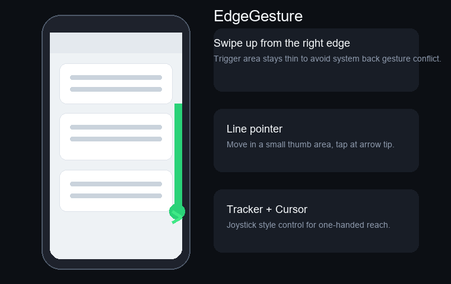

# EdgeGesture



[中文](#中文) | [English](#english)

## 中文

EdgeGesture 是一个 LSPosed/Xposed 单手边缘手势模块。

App 本身只是设置面板。真正的手势监听运行在模块注入的 `system_server` 中，所以模块加载后，即使杀掉 App 进程，手势也应该继续可用。

### 功能

- 右边缘上划触发单手点击屏幕。
- 直线箭头指针模式。
- Tracker + Cursor 摇杆光标模式。
- 可调触发区域、指针速度、平滑度、颜色、自动取消时间和取消距离。
- Compose + Material 3 设置界面。
- 日志输出到 LSPosed，标签为 `EdgeGesture`。

### 使用要求

- 已 Root 的 Android 设备。
- 已安装并启用 LSPosed。
- 项目当前面向 Android API 36。

### 编译

```bash
./gradlew :app:assembleRelease
```

Release APK 输出位置：

```text
app/build/outputs/apk/release/app-release.apk
```

当前 release 构建为了方便本地测试，暂时使用 debug 签名配置。

### 使用方法

1. 安装 APK。
2. 在 LSPosed 中启用模块。
3. 确认作用域包含 Android 系统/框架。
4. 重启手机。
5. 打开 App 并启用手势。

如果需要排查问题，请在 LSPosed 日志中搜索 `EdgeGesture`。

### 当前状态

当前版本：`1.0`。

这是测试版模块，会 hook `system_server` 的输入处理逻辑，请谨慎使用。

### 贡献者

详见 [CONTRIBUTORS.md](CONTRIBUTORS.md)。

## English

EdgeGesture is an LSPosed/Xposed one-handed edge gesture module.

The app itself is only a settings panel. Gesture monitoring runs inside `system_server` through the injected module, so gestures should keep working after the module is loaded even if the app process is killed.

### Features

- Swipe up from the right edge to trigger a one-handed screen tap.
- Line arrow pointer mode.
- Tracker + Cursor mode.
- Adjustable trigger area, pointer speed, smoothing, color, auto-cancel timeout, and cancel distance.
- Compose + Material 3 settings UI.
- Logs are written to LSPosed with the `EdgeGesture` tag.

### Requirements

- Rooted Android device.
- LSPosed installed and enabled.
- The project currently targets Android API 36.

### Build

```bash
./gradlew :app:assembleRelease
```

Release APK output:

```text
app/build/outputs/apk/release/app-release.apk
```

For easier local testing, the current release build temporarily uses the debug signing configuration.

### Usage

1. Install the APK.
2. Enable the module in LSPosed.
3. Make sure the scope includes Android system/framework.
4. Reboot the phone.
5. Open the app and enable gestures.

For troubleshooting, search for `EdgeGesture` in LSPosed logs.

### Status

Current version: `1.0`.

This is a beta module that hooks the input handling path in `system_server`; use it carefully.

### Contributors

See [CONTRIBUTORS.md](CONTRIBUTORS.md).
